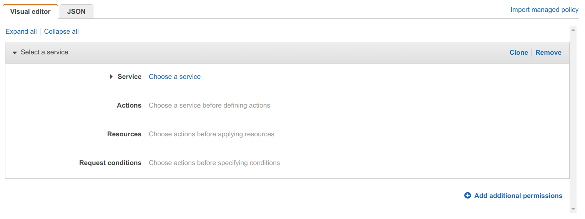
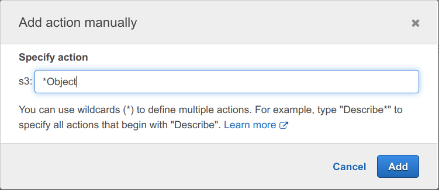

```
$ python3 -m venv venv
$ source venv/bin/activate
(venv) $ pip install --upgrade pip
```

Install boto3 and the [boto3-stubs](https://pypi.org/project/boto3-stubs/) type annotations:

```
(venv) $ pip install boto3
(venv) $ pip install 'boto3-stubs[essential,logs]'
```

Note: the stubs won't pull in `boto3` as a dependency - you have to install both `boto3` and the stubs.

Metadata
--------

On an EC2 instance, you can get your region like so:

```
$ curl http://instance-data/latest/meta-data/placement/availability-zone/
```

For all the other metadata, you can retrieve, see:

```
$ curl http://instance-data/latest/meta-data
```

On non-Amazon AMIs, you may have to use `169.254.169.254` rather than `instance-data` as the host.

You can also use the command xxx:

```
$ ec2-metadata
ami-id: ami-09439f09c55136ecf
...
$ ec2-metadata --help
...
```

You should also be able to do:

```
$ cloud-init query --all
```

However, Amazon use an old version of `cloud-init` that will only work if run as root.

But you can find the JSON data it would query in `/run/cloud-init/instance-data.json`

S3 access on an EC2 instance
----------------------------

If you try and `ls` one of your buckets, it'll fail:

```
$ aws s3 ls s3://d9983d65-b1bd-4bcd-a442-aae6c9b0d607
Unable to locate credentials. You can configure credentials by running "aws configure".
```

But rather than uploading your credentials (which you should be keeping extra safe), you can:

<https://www.youtube.com/watch?v=0zq9eC1M5Dk>

Similarly, try:

```
$ mkdir boto3-experiments
$ cd boto3-experiments
$ python3 -m venv venv
$ source venv/bin/activate
$ pip install --upgrade pip
$ pip install boto3
$ cat > main.py << 'EOF'
import boto3

# Something that access S3.

EOF
$ python main.py
None
```

This will also fail.

So, in the AWS web console, go to _IAM / Roles_. Click the _Create Role_ button, select _EC2_ under _Common use cases_ and click _Next_.

Click _Create Policy_, in the end it does seem easier to use the _JSON_ tab rather than the _Visual Editor_ tab. But let's give it a try.



First, choose a service, i.e. S3. Then in _Actions_, expand _List_ and tick _ListBucket_.

The _Manual actions_ section is a bit confusing initially, click _add actions_ and enter:



This is a quick alternative to going through the _Read_, _Write_ etc. sections and ticking all the actions ending with "Object" - these are the ones you need if you want to read, write and delete objects.

Then got to the _Resources_ section and tick _All resources_ to stop it complaining that you have to specify ARNs for some of the actions you selected.

Now, jump to the _JSON_ tab and you'll see this translates to just:

```json
{
    "Version": "2012-10-17",
    "Statement": [
        {
            "Sid": "VisualEditor0",
            "Effect": "Allow",
            "Action": [
                "s3:*Object",
                "s3:ListBucket"
            ],
            "Resource": "*"
        }
    ]
}
```

`"Sid"` is the statement ID - you could put whatever you want there (it just has to uniquely identify the given statement within the list of 1 or more statements).

Note: the above isn't far off from the already available _AmazonS3FullAccess_ policy.

You could split things out and specify specific resources:

```json
{
    "Version": "2012-10-17",
    "Statement": [
        {
            "Sid": "ListObjectsInBucket",
            "Effect": "Allow",
            "Action": ["s3:ListBucket"],
            "Resource": ["arn:aws:s3:::bucket-name"]
        },
        {
            "Sid": "AllObjectActions",
            "Effect": "Allow",
            "Action": "s3:*Object",
            "Resource": ["arn:aws:s3:::bucket-name/*"]
        }
    ]
}
```

Note the wildcard in the second `"Resource"` value. This example is from [here](https://docs.aws.amazon.com/IAM/latest/UserGuide/reference_policies_examples_s3_rw-bucket.html) in the AWS IAM documentation.

OK - now we have the policy details, click _Next_, skip over _Tags_ and on the _Review_ page just enter a name like "S3ReadWriteAccessPolicy".

Now, return to the _Roles_ browser tab (you we're in the _Add permissions_ section) where you were before pressing _Create Policy_.

In the _Permission policies_ section, tick the policy that you just created and click _Next_.

Just enter a _Role Name_, like "S3ReadWriteAccessRole", and click _Create Role_.

---

Now, back to the _EC2 / Instances_ console. Oddly, after all the roles stuff, the region confusingly defaults to something other than my eu-central-1 zone and no instances are shown.

Once you've switched region if necessary, tick your instance, go to _Actions / Security / Modify IAM role_, select the newly created role and click _Update IAM role_.


Get the region locally or on EC2
--------------------------------

```
import boto3

session = boto3.session.Session()
current_region = session.region_name

if current_region is None:
    from botocore.utils import IMDSRegionProvider
    import botocore.session

    imds_region_provider = IMDSRegionProvider(session=botocore.session.get_session())
    current_region=imds_region_provider.provide()

print(current_region)
```

All `session.region_name` does is get the `region` value from `~/.aws/config`.

On an EC2 instance with no `~/.aws/config`, it'll return `None`.

In that situation, `IMDSRegionProvider` will do the equivalent of `curl http://instance-data/latest/meta-data/placement/availability-zone/`.

Write to an existing bucket from on EC2
---------------------------------------

For an instance that's got the necessary IAM role (as described above):

```
import boto3
from botocore.config import Config

# As of Boto3 1.23.8, the default `defaults_mode` is still `legacy`.
# See https://docs.aws.amazon.com/sdkref/latest/guide/feature-smart-config-defaults.html
config = Config(defaults_mode="standard")
s3_resource = boto3.resource("s3", config=config)

# This is a bucket I created previously.
bucket = s3_resource.Bucket(name="97e1721f-caf9-4729-9aa2-e62ab5c3991c")

obj = bucket.Object("my_first_file")

obj.put(Body="foo bar")

print("Success")
```

Get latest version of AMI
-------------------------

    $ aws ec2 describe-images --owners aws-marketplace --filter 'Name=name,Values=amzn2-ami-graphics-hvm-*' --query 'sort_by(Images, &CreationDate)[-1].Name' --output text

Roles
-----

See [`create-role.md`](docs/create-role.md).

Security groups
---------------

See [`create-security-groups.md`](docs/create-security-group.md)

Python scripts with main
------------------------

* `run_manager`
* `run_worker`
* `create_file_store` - run once and store result in xxx and upload a version of Blender there and store that also in xxx. 
* `clean_up.py`

Power-off
---------

The most aggressive power-off seems to be:

    $ sudo poweroff --no-wtmp --no-wall --force --force

Specifying `--force` twice "results in an immediate shutdown without contacting the system manager."

Note: this seems a bit to brutal as it doesn't give `ssh` a chance to properly disconnect you.

For a proper disconnect:

    $ sudo poweroff --no-wtmp --no-wall

Putting log events from the CLI
-------------------------------

The `aws` command on the boxes is actually v1.

Install AWS CLI v2 (yes, there really doesn't seem to be a `yum` package):

    $ curl https://awscli.amazonaws.com/awscli-exe-linux-x86_64.zip -o awscliv2.zip
    $ unzip awscliv2.zip
    $ sudo ./aws/install

It's installed to `/usr/local/bin`, so:

    $ PATH=/usr/local/bin:$PATH

Listen for log events:

    $ /usr/local/bin/aws logs tail render-job-log-group-d1f294c6-1c17-430d-82b5-bc8136f84b71 --follow

To create log events - first, create a stream (for the existing group):

    $ /usr/local/bin/aws logs create-log-stream --log-group-name render-job-log-group-d1f294c6-1c17-430d-82b5-bc8136f84b71 --log-stream-name foobar

Create an `events.json`:

```
$ cat > events.json << 'EOF'
[
  {
    "timestamp": 1654437914755,
    "message": "Example Event 1"
  },
  {
    "timestamp": 1654437914756,
    "message": "Example Event 2"
  },
  {
    "timestamp": 1654437914757,
    "message": "Example Event 3"
  }
]
```

Update the `timestamp` values with values generated using:

    $ date +%s%3N

And then put them like so:

    $ aws logs put-log-events --log-group-name render-job-log-group-d1f294c6-1c17-430d-82b5-bc8136f84b71 --log-stream-name foobar --log-events file://events.json

To put further events, you have to use the `sequence-token` returned by the first `put-log-events`:

    $ aws logs put-log-events --log-group-name render-job-log-group-d1f294c6-1c17-430d-82b5-bc8136f84b71 --log-stream-name foobar --log-events file://events.json --sequence-token 49620733793119385444699042086678722610600419464713621746

EC2 instance setup
------------------

TODO: this is out-of-date - there is no `run_worker.ini` anymore.

Make sure IAM role is attached before copying from S3.

Download and unpack Blender:

    $ s3_file='s3://file-store-dcede0e0-aec4-4920-9532-c89a3a151af2/blender-3.1.2-linux-x64.tar.xz'
    $ aws s3 cp $s3_file .
    $ mkdir blender
    $ time tar -xf ${s3_file##*/} --strip-components=1 -C blender

Set up the virtual environment:

    $ python3 -m venv venv
    $ source venv/bin/activate
    $ pip install --upgrade pip
    $ pip install boto3 'boto3-stubs[essential,logs]'

Make sure `run_worker.ini` contains the right job ID etc.

Start the job:

    $ python run_worker.py

DynamoDB
--------

Deleting items that match a filter:

```
items = table.scan(FilterExpression=Attr("in_progress").eq(1), ConsistentRead=True)["Items"]
for i in items:
    table.delete_item(Key={"filler": 0, "frame": i["frame"]})
```

You can filter for something but there's no way to just say "return me the first item that matches the filter", the `Limit` parameter limits the number of items _before_ the filtering is applied!

User-data default interpreter
-----------------------------

A little surprisingly, the default interpreter for user-data, when launching an instance, seems to be Python. So if you pass it e.g. a sequence of shell commands you end up with an error like this in `/var/log/cloud-init-output.log`

```
Jun 11 11:21:12 cloud-init[2401]: __init__.py[WARNING]: Unhandled non-multipart (text/x-not-multipart) userdata: 'aws s3 cp s3://render-jo...'
```

The important bit is `__init__.py` which gives you the clue that something Python related is trying to consume the user data.

Actually, looking at the cloud-init [documentation](https://cloudinit.readthedocs.io/en/latest/topics/format.html#user-data-script), I think it assumes a multipart archive (and the `__init.py__` warning is coming from the cloud-init logic trying to consume this) and that if you want you data interpreted as a script then you must include a `#!`.

Spot instances
--------------

The documentation for the _instance market options_ that are used to configure a spot request aren't very well documented - the best description seems to be in the boto3 API reference documentation for [`run_instances`](https://boto3.amazonaws.com/v1/documentation/api/latest/reference/services/ec2.html#EC2.Client.run_instances).

```
InstanceMarketOptions={
    'MarketType': 'spot',
    'SpotOptions': {
        'MaxPrice': 'string',
        'SpotInstanceType': 'one-time'|'persistent',
        'BlockDurationMinutes': 123,
        'ValidUntil': datetime(2015, 1, 1),
        'InstanceInterruptionBehavior': 'hibernate'|'stop'|'terminate'
    }
}
```

`MaxPrice` defaults to the on-demand price if not specified. `SpotInstanceType` defaults to `one-time`, `BlockDuration` is deprecated, `ValidUntil` can't be used with `one-time` and `InstanceInterruptionBehavior` defaults to and has to be `terminate` for `one-time`.

So simply specifying `MarketType` is enough if you just want `one-time` behavior and are happy to pay the on-demand price in the worst case.

The documentation doesn't say that `SpotInstanceType` defaults to `one-time` but you can see this is the case, if you e.g. just specify `MarketType=spot` and nothing else, and then look at the _Spot Requests_ in the EC2 dashboard - there you see "Persistence: one-time".

Spot pricing
------------

It doesn't seem to be possible to ask "what price am I paying for my currently running spot instances?" Instead, you have to look up the current spot price for the relevant availability zone.

You can do this like so:

```
$ aws ec2 describe-spot-price-history --start-time=$(date +%s) --product-descriptions='Linux/UNIX' --instance-types g4dn.xlarge
{
    "SpotPriceHistory": [
        {
            "AvailabilityZone": "eu-central-1c",
            "InstanceType": "g4dn.xlarge",
            "ProductDescription": "Linux/UNIX",
            "SpotPrice": "0.197400",
            "Timestamp": "2022-06-10T21:56:38+00:00"
        },
        {
            "AvailabilityZone": "eu-central-1b",
            "InstanceType": "g4dn.xlarge",
            "ProductDescription": "Linux/UNIX",
            "SpotPrice": "0.197400",
            "Timestamp": "2022-06-10T19:46:42+00:00"
        },
        {
            "AvailabilityZone": "eu-central-1a",
            "InstanceType": "g4dn.xlarge",
            "ProductDescription": "Linux/UNIX",
            "SpotPrice": "0.197400",
            "Timestamp": "2022-06-10T19:46:42+00:00"
        }
    ]
}
```

You seem to just get the most recent price change, e.g. the above command was run more than 12 hours after the UTC values shown in the `Timestamp` fields. A price seems to be published at least once a day even if the price hasn't changed since the previous day.

I'm surprised how little price variance there is for these spot instances. If you run the following command, you get the last two months of price updates:

```
$ aws ec2 describe-spot-price-history --product-descriptions='Linux/UNIX' --instance-types g4dn.xlarge
```

You can see the price is very consistently $0.1974, which was exactly 30% of the on-demand price of $0.658. Perhaps 30% is a lower-bound that AWS sets on spot prices, it never dips below this. And it only occasionally rises above this and only on one of the three availability zones - `eu-central-1c` - for my region - `eu-central-1`. I don't know if this reflects how AWS manages things when they finally do reach capacity across zones and that, however things are managed, the situation never arose that they started feeling enough capacity pressure that things spilled over into the `1a` and `1b` zones - but it is odd to see the `1a` and `1b` prices staying at $0.1974 while seeing them rise steeply in just `1c` (occasionally, to very near the on-demand price).

Public IP address
-----------------

Question: can I create the instance without any public IP at all?

Answer: no - it needs an IP to access the internet - otherwise you'd have to set up some form of VPN (that does have a public IP) that can mediate between your instance and the public internet.

If I got rid of the pip access, I could probably get rid of the public IP as I wouldn't need public internet access for anything else.

Installing PyPi packages without internet
-----------------------------------------

See:

* https://stackoverflow.com/questions/11091623/how-to-install-packages-offline
* https://pip.pypa.io/en/stable/user_guide/#installing-from-local-packages
* https://thilinamad.medium.com/install-python-packages-via-pip-without-an-internet-connection-b3dee83b4c2d

Running jobs from the command line
----------------------------------

```
$ source venv/bin/activate
(venv) $ python run_manager.py --ec2-instances 8 --start=1 --end=16 --samples=64 --enable-motion-blur my-blender-file.blend
```
